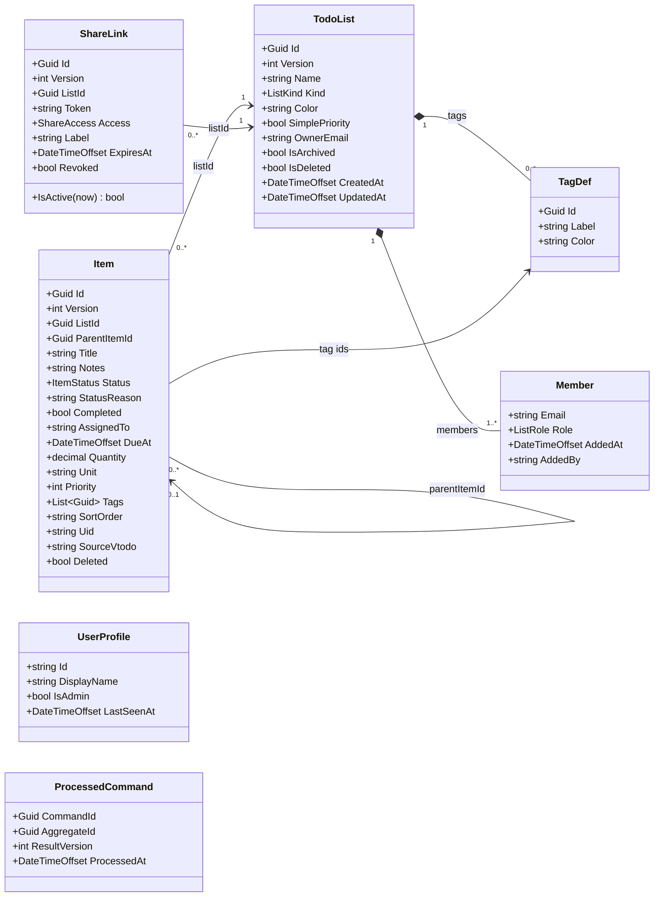

# Architecture

Lupira Tasks API is a single bounded context — shared task and shopping lists — implemented as an
event-sourced .NET service over PostgreSQL (via [Marten](https://martendb.io/)). One store backs four
surfaces (REST, MCP, public share links, the DAV-backend seam); each is a thin adapter over the same application
services, so the surfaces can never diverge.

## Why event sourcing

The clients are offline-first: a phone edits lists with no connectivity, queues the changes, and
replays them on reconnect — possibly out of order, possibly alongside edits another member made to the
same item. Two mechanisms make that converge:

- **Idempotency** — every mutation carries a command id (the `Idempotency-Key` header on REST, minted
  server-side for MCP/DAV). A redelivered command is recorded once in the `ProcessedCommand` ledger
  and replayed as a no-op that returns the prior result.
- **Per-field last-writer-wins (LWW)** — each mutable field on an item carries a guard of
  `(OccurredAt, CommandId)`. A field update only wins if its guard is newer; `CommandId` is the
  deterministic tiebreaker on an exact timestamp tie. The same pure reducer (`ItemLww`) runs on the
  server snapshot and can be shared with the client, so both sides converge identically regardless of
  apply order.

Events are the natural fit: they are the unit the client queues, the unit idempotency dedupes, and the
unit LWW orders.

### Projection style

Aggregates are projected as **inline single-stream snapshots** (`SnapshotLifecycle.Inline`), not
multi-stream projections and not an async daemon. Each aggregate is one stream (stream id = the
aggregate id), projected immediately on append, so reads are O(1) and immediately consistent. There is
no read model separate from the snapshot.

See [`MartenRegistrations`](../src/LupiraTasksApi.Core/Data/MartenRegistrations.cs) for the full store
configuration.

## Domain model

> Nullable fields (`Color`, `Notes`, `AssignedTo`, `DueAt`, `Quantity`, `Unit`, `SourceVtodo`,
> `ParentItemId`, `ExpiresAt`, `AddedBy`, `DisplayName`) are shown without the `?` for diagram
> compatibility; see the source for exact nullability. `Completed` is derived (`Status == Done`), not a
> stored field. `Item` also carries per-field LWW guards (`(OccurredAt, CommandId)` for name, notes,
> assignee, due, quantity, priority, status, move, and the raw VTODO blob, plus a per-tag guard map) —
> the one status guard covers the whole lifecycle (complete/reopen/status-change). These live on
> [`ItemState`](../src/LupiraTasksApi.Core/Domain/Items/ItemState.cs), not on the wire DTO.

### Aggregates (event-sourced)

| Aggregate | Stream id | Role | Source |
| --- | --- | --- | --- |
| `TodoList` | list id | A list's metadata, tag definitions, and membership | [TodoList.cs](../src/LupiraTasksApi.Core/Domain/Lists/TodoList.cs) |
| `Item` | item id | A task/line item; nests via `ParentItemId`; references the list's tags by id | [Item.cs](../src/LupiraTasksApi.Core/Domain/Items/Item.cs) |
| `ShareLink` | share id (non-secret) | An account-less grant to one list at one access level | [ShareLink.cs](../src/LupiraTasksApi.Core/Domain/Shares/ShareLink.cs) |

`TagDef` and `Member` are value objects contained in the `TodoList` stream — they have no independent
identity outside their list.

### Support documents (plain Marten documents, not event-sourced)

| Document | Identity | Role |
| --- | --- | --- |
| `UserProfile` | email | Identity cache, upserted on `/me`; resolves display names for the directory and attribution |
| `ProcessedCommand` | command id | Idempotency ledger; marks a command processed so redelivery is a no-op |

### Enums

| Enum | Values (ordered) | Meaning |
| --- | --- | --- |
| `ListKind` | `Todo`, `Shopping` | Drives client affordances (shopping lists surface quantity/unit) |
| `ListRole` | `Owner` > `Editor` > `Viewer` | Member authority; lower ordinal = higher privilege |
| `ShareAccess` | `Read`, `ReadWrite` | What a public share link permits |

`Item.Priority` is the standard iCalendar VTODO priority: `0` = none/undefined, `1..9` in range.
`TodoList.SimplePriority` is a render-neutral hint (default `true`) that clients map to their own
control — a checkbox vs. the full 0..9 scale — and is **not** UI rendering itself.

## Ownership and identity

Identity is the **email** claim of the OIDC bearer token (the service holds no password store and no
API keys). The application layer reduces every authenticated request to a
[`Caller`](../src/LupiraTasksApi.Core/Application/Caller.cs), which is one of two shapes:

- **Member** — a real user with an `Email` and `Groups`, built from the JWT by each surface adapter.
- **Share** — an account-less share-link recipient (`ShareGrant`: scoped to one list at one
  `ShareAccess`), with no email.

Every mutation stamps an `actor` header into its events — a member's email, or `share:{label}` for a
share-link write. Aggregates read it back to populate `CreatedBy`, `CompletedBy`, `Member.AddedBy`, and
`RevokedBy`. Admin rights come from membership in a configured admin group; a share-link caller is
never admin.

### Authorization and the 404-not-403 rule

[`AccessResolver`](../src/LupiraTasksApi.Core/Auth/AccessResolver.cs) is the single membership gate. It
loads the `TodoList` snapshot and checks the caller's effective role against a required minimum
(`Owner` > `Editor` > `Viewer`; a share grant maps `ReadWrite ≈ Editor`, `Read ≈ Viewer`).

A denial — missing list, deleted list, non-member, or insufficient role — returns **404, never 403**.
A caller who can't see a list cannot distinguish "no such list" from "exists but you lack access," so
list existence is never leaked.

## Error handling and transport mapping

Services never throw for expected outcomes; they return a transport-neutral
[`OpResult`/`OpResult<T>`](../src/LupiraTasksApi.Core/Application/OpResult.cs) carrying an `OpStatus`.
Each surface maps it to its own wire shape — REST via
[`OpResultMap`](../src/LupiraTasksApi/Http/OpResultMapping.cs) to typed `Results<...>` unions that keep
the OpenAPI contract fixed. Genuinely exceptional Marten concurrency faults stay as exceptions inside
the service (and are treated as idempotency replays).

| `OpStatus` | HTTP (REST) | Notes |
| --- | --- | --- |
| `Ok` | 200 `Ok<T>` / 204 `NoContent` | Value or no-content shape per handler |
| `NotFound` | 404 | Also the surfaced result of an authorization denial |
| `Forbidden` | 403 ProblemDetails | Carries a message |
| `Invalid` | 400 ProblemDetails | Validation failure, carries a message |
| `Conflict` | 412 Precondition Failed | **DAV seam only** (`If-Match`/`If-None-Match` ETag mismatch); REST/MCP mappers never receive it |

## DAV-backend VTODO round-trip

The LAN-only `/dav-backend` seam (consumed by the LupiraDavApi gateway — see [dav-backend-contract.md](dav-backend-contract.md)) exposes items as iCalendar VTODO resources, mapped by
[`VtodoMapper`](../src/LupiraTasksApi.Core/Ical/VtodoMapper.cs):

- **GET regenerates** the VTODO from the live snapshot rather than echoing a stored blob — REST/MCP
  edits use granular events that never touch the stored blob, so an echoed blob would go stale. Modeled
  properties (`UID`, `SUMMARY`, `DESCRIPTION`, `DUE`, `STATUS`/`PERCENT-COMPLETE`/`COMPLETED`,
  `CATEGORIES`, `PRIORITY`, timestamps, and `X-LUPIRA-*` for assignee/quantity/unit) are written from
  the snapshot; every **unmodeled** top-level property from the last PUT (`RRULE`, custom `X-*`, …) is
  spliced back in from `Item.SourceVtodo` so it survives the round-trip.
- **PUT** parses the modeled fields and emits an `ItemVtodoPut` event, which competes per-field against
  the granular REST/MCP events through the same LWW guards. The raw payload is stored in
  `Item.SourceVtodo` for lossless re-emission.
- **Concurrency** uses the `If-Match` ETag, which is the item's stream `Version`; a mismatch is
  an `OpStatus.Conflict` → 412.
- `CATEGORIES` map to the list's `TagDef` labels (case-insensitive); unknown labels are ignored, so a
  client can't create uncontrolled tags. VALARM sub-components are stored but not re-emitted in v1 — a
  known gap.

## Bounded-context boundary

**In scope:** lists (create/rename/recolor/archive/restore/delete), items (add/edit/move/complete/
reopen/delete, nesting one level via `ParentItemId`), tag definitions, membership and roles, share
links, DAV sync, the user-profile cache, idempotency, and per-field LWW conflict resolution.

**Out of scope:** authentication itself (delegated to the OIDC provider), notifications/webhooks, a
separate audit log (the event streams are the history), real-time collaboration (eventual consistency,
no operational transform), recurring tasks, and nesting beyond one parent level.
