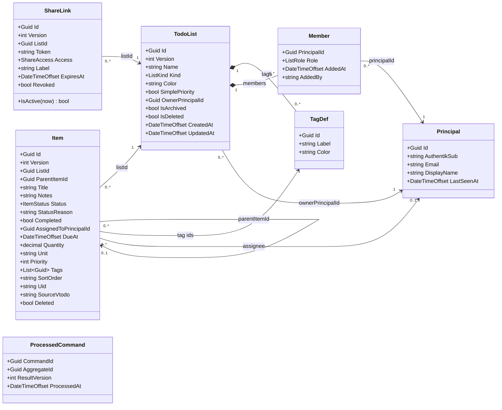

# Architecture

Lupira Tasks API is a single bounded context — shared task and shopping lists — implemented as an
event-sourced .NET service over PostgreSQL (via [Marten](https://martendb.io/)). One store backs four
surfaces (REST, MCP, public share links, the DAV-backend seam); each is a thin adapter over the same application
services, so the surfaces can never diverge.

## Why event sourcing

The clients are offline-first: a phone edits lists with no connectivity, queues the changes, and
replays them on reconnect — possibly out of order, possibly alongside edits another member made to the
same item. Two mechanisms make that converge:

- **Idempotency** — every mutation carries a command id (the `Idempotency-Key` header on REST, minted
  server-side for MCP/DAV). A redelivered command is recorded once in the `ProcessedCommand` ledger
  and replayed as a no-op that returns the prior result.
- **Per-field last-writer-wins (LWW)** — each mutable field on an item carries a guard of
  `(OccurredAt, CommandId)`. A field update only wins if its guard is newer; `CommandId` is the
  deterministic tiebreaker on an exact timestamp tie. The same pure reducer (`ItemLww`) runs on the
  server snapshot and can be shared with the client, so both sides converge identically regardless of
  apply order.

Events are the natural fit: they are the unit the client queues, the unit idempotency dedupes, and the
unit LWW orders.

### Projection style

Aggregates are projected as **inline single-stream snapshots** (`SnapshotLifecycle.Inline`), not
multi-stream projections and not an async daemon. Each aggregate is one stream (stream id = the
aggregate id), projected immediately on append, so reads are O(1) and immediately consistent. There is
no read model separate from the snapshot.

See [`MartenRegistrations`](../src/LupiraTasksApi.Core/Data/MartenRegistrations.cs) for the full store
configuration.

## Domain model



> Nullable fields (`Color`, `Notes`, `AssignedToPrincipalId`, `DueAt`, `Quantity`, `Unit`, `SourceVtodo`,
> `ParentItemId`, `ExpiresAt`, `AddedBy`, `DisplayName`) are shown without the `?` for diagram
> compatibility; see the source for exact nullability. `Completed` is derived (`Status == Done`), not a
> stored field. `Item` also carries per-field LWW guards (`(OccurredAt, CommandId)` for name, notes,
> assignee, due, quantity, priority, status, move, and the raw VTODO blob, plus a per-tag guard map) —
> the one status guard covers the whole lifecycle (complete/reopen/status-change). These live on
> [`ItemState`](../src/LupiraTasksApi.Core/Domain/Items/ItemState.cs), not on the wire DTO.

### Aggregates (event-sourced)

| Aggregate | Stream id | Role | Source |
| --- | --- | --- | --- |
| `TodoList` | list id | A list's metadata, tag definitions, and membership | [TodoList.cs](../src/LupiraTasksApi.Core/Domain/Lists/TodoList.cs) |
| `Item` | item id | A task/line item; nests via `ParentItemId`; references the list's tags by id | [Item.cs](../src/LupiraTasksApi.Core/Domain/Items/Item.cs) |
| `ShareLink` | share id (non-secret) | An account-less grant to one list at one access level | [ShareLink.cs](../src/LupiraTasksApi.Core/Domain/Shares/ShareLink.cs) |

`TagDef` and `Member` are value objects contained in the `TodoList` stream — they have no independent
identity outside their list.

### Support documents (plain Marten documents, not event-sourced)

| Document | Identity | Role |
| --- | --- | --- |
| `Principal` | principal id (Guid) | Identity anchor, JIT-provisioned via `PrincipalDirectory`; indexed by `AuthentikSub` (durable) + `Email` (mutable). Resolves logins → principal id (writes) and ids → `PersonRef` (reads) |
| `ProcessedCommand` | command id | Idempotency ledger; marks a command processed so redelivery is a no-op |

### Enums

| Enum | Values (ordered) | Meaning |
| --- | --- | --- |
| `ListKind` | `Todo`, `Shopping` | Drives client affordances (shopping lists surface quantity/unit) |
| `ListRole` | `Owner` > `Editor` > `Viewer` | Member authority; lower ordinal = higher privilege |
| `ShareAccess` | `Read`, `ReadWrite` | What a public share link permits |

`Item.Priority` is the standard iCalendar VTODO priority: `0` = none/undefined, `1..9` in range.
`TodoList.SimplePriority` is a render-neutral hint (default `true`) that clients map to their own
control — a checkbox vs. the full 0..9 scale — and is **not** UI rendering itself.

## Ownership and identity

Identity is anchored on an internal **principal id** (a Guid). A login (OIDC `sub` + email, or a DAV
email) is resolved — and JIT-provisioned — to a [`Principal`](../src/LupiraTasksApi.Core/Domain/Identity/Principal.cs)
by [`PrincipalDirectory`](../src/LupiraTasksApi.Core/Application/PrincipalDirectory.cs): it matches on
the immutable `AuthentikSub` first, then email, so the durable key is the `sub` and an email change
never strands access. Emails live only on the `Principal` document (plus an `actor.email` audit
header) — no email is baked into an event payload. The host funnels every login to a
[`Caller`](../src/LupiraTasksApi.Core/Application/Caller.cs) via `CallerFactory`; a `Caller` is one of:

- **Member** — a real user carrying their resolved `PrincipalId` (+ email/groups), built from the JWT.
- **Share** — an account-less share-link recipient (`ShareGrant`: scoped to one list at one
  `ShareAccess`), with no principal.

**Edge contract:** the API stays email-facing. Identity *inputs* take an email (invite a member,
assign) — the service resolves/provisions the principal; identity *outputs* are a
[`PersonRef`](../src/LupiraTasksApi.Core/Dtos/PersonRef.cs) `{ principalId, email, displayName }`
resolved at the read boundary. Member manage-routes and client self-matching use the stable
`principalId` (`PATCH/DELETE /lists/{listId}/members/{principalId}`); `/me` returns the caller's
`principalId`. The DAV seam keeps the email in its path (`/dav-backend/u/{email}`) — the gateway does
the LDAP bind and only knows email — and resolves it server-side.

Every mutation stamps four provenance facts onto its events via
[`EventActor.Stamp`](../src/LupiraTasksApi.Core/Domain/EventActor.cs) before the single commit
(they are unbackfillable, so they are never optional):

- **actor** header — a member's `PrincipalId`, or `share:{label}` for a share-link write. Aggregates
  read it into `CreatedBy`, `CompletedBy`, `Member.AddedBy`, and `RevokedBy`; the read layer resolves
  a Guid-shaped actor to a `PersonRef` (a `share:*` actor resolves to `null`).
- **actor.email** header — the member's email at the time, a human-audit convenience (absent for a
  share write; a future erasure routine can scrub it).
- **causation id** — the originating command id (the direct cause of the events).
- **correlation id** — the current OpenTelemetry trace id, so every event links back to the request
  that produced it (absent only when no trace is active).

Admin rights come from membership in a configured admin group; a share-link caller is never admin.

### Authorization and the 404-not-403 rule

[`AccessResolver`](../src/LupiraTasksApi.Core/Auth/AccessResolver.cs) is the single membership gate. It
loads the `TodoList` snapshot and checks the caller's effective role against a required minimum
(`Owner` > `Editor` > `Viewer`; a share grant maps `ReadWrite ≈ Editor`, `Read ≈ Viewer`).

A denial — missing list, deleted list, non-member, or insufficient role — returns **404, never 403**.
A caller who can't see a list cannot distinguish "no such list" from "exists but you lack access," so
list existence is never leaked.

## Error handling and transport mapping

Services never throw for expected outcomes; they return a transport-neutral
[`OpResult`/`OpResult<T>`](../src/LupiraTasksApi.Core/Application/OpResult.cs) carrying an `OpStatus`.
Each surface maps it to its own wire shape — REST via
[`OpResultMap`](../src/LupiraTasksApi/Http/OpResultMapping.cs) to typed `Results<...>` unions that keep
the OpenAPI contract fixed. Genuinely exceptional Marten concurrency faults stay as exceptions inside
the service (and are treated as idempotency replays).

| `OpStatus` | HTTP (REST) | Notes |
| --- | --- | --- |
| `Ok` | 200 `Ok<T>` / 204 `NoContent` | Value or no-content shape per handler |
| `NotFound` | 404 | Also the surfaced result of an authorization denial |
| `Forbidden` | 403 ProblemDetails | Carries a message |
| `Invalid` | 400 ProblemDetails | Validation failure, carries a message |
| `Conflict` | 412 Precondition Failed | **DAV seam only** (`If-Match`/`If-None-Match` ETag mismatch); REST/MCP mappers never receive it |

## DAV-backend VTODO round-trip

The LAN-only `/dav-backend` seam (consumed by the LupiraDavApi gateway — see [dav-backend-contract.md](dav-backend-contract.md)) exposes items as iCalendar VTODO resources, mapped by
[`VtodoMapper`](../src/LupiraTasksApi.Core/Ical/VtodoMapper.cs):

- **GET regenerates** the VTODO from the live snapshot rather than echoing a stored blob — REST/MCP
  edits use granular events that never touch the stored blob, so an echoed blob would go stale. Modeled
  properties (`UID`, `SUMMARY`, `DESCRIPTION`, `DUE`, `STATUS`/`PERCENT-COMPLETE`/`COMPLETED`,
  `CATEGORIES`, `PRIORITY`, timestamps, and `X-LUPIRA-*` for assignee/quantity/unit) are written from
  the snapshot; every **unmodeled** top-level property from the last PUT (`RRULE`, custom `X-*`, …) is
  spliced back in from `Item.SourceVtodo` so it survives the round-trip.
- **PUT** parses the modeled fields and emits an `ItemVtodoPut` event, which competes per-field against
  the granular REST/MCP events through the same LWW guards. The raw payload is stored in
  `Item.SourceVtodo` for lossless re-emission.
- **Concurrency** uses the `If-Match` ETag, which is the item's stream `Version`; a mismatch is
  an `OpStatus.Conflict` → 412.
- `CATEGORIES` map to the list's `TagDef` labels (case-insensitive); unknown labels are ignored, so a
  client can't create uncontrolled tags. VALARM sub-components are stored but not re-emitted in v1 — a
  known gap.

## Event schema & evolution

Every event's durable storage alias (the `mt_events.type` string) is pinned explicitly in
[`MartenRegistrations.MapEvents`](../src/LupiraTasksApi.Core/Data/MartenRegistrations.cs), decoupled
from the CLR type name. Each alias equals Marten's current snake_case default (e.g. `ItemAdded` →
`item_added`), so pinning changed nothing in storage — it froze the contract. **A record can now be
renamed or relocated without breaking deserialization of history.**

**Evolution rule:** a breaking shape change is a *new versioned type mapped to the same alias plus an
upcaster* — never a trailing-optional field. A trailing-optional param silently defaults every
historical event, which corrupts state whenever the default is not semantically neutral. Making the
default explicit at an upcast site keeps it reviewed. Worked example (adding a `Source` to
`ItemAdded`):

```csharp
// ItemAddedV2 is the new shape; both map to the SAME alias, distinguished by schema version.
opts.Events.MapEventType<ItemAdded>("item_added");                       // v1 (implicit)
opts.Events.MapEventTypeWithSchemaVersion<ItemAddedV2>("item_added", 2); // v2 writes going forward

// Read path: transform persisted v1 rows to v2, with the new field's default explicit here.
opts.Events.Upcast<ItemAdded, ItemAddedV2>(old =>
    new ItemAddedV2(old.ItemId, old.ListId, old.ParentItemId, old.Title,
        old.SortOrder, old.OccurredAt, old.CommandId, old.Uid, ItemSource.Unknown));
```

Events carry no derived/denormalized values (rollups, hashes) — those are computed in the projection,
so a formula fix heals on rebuild. Enums serialize by name (`JsonStringEnumConverter`), so appending
values is safe; renaming/removing a value is a breaking change to both stored events and the API.

## Cross-aggregate references & cleanup

References across aggregates carry no FK — integrity is by convention. Two are cleaned at command
time (in the same transaction as the tombstone, so a lost dedup race rolls the cleanup back too);
the rest are deliberately tolerated at read time.

| Edge | On source removal | Handling |
| --- | --- | --- |
| `Relation.FromId` → `Item` | item tombstoned | **Cascade**: relations deleted (`ItemService.DeleteAsync`, `TaskDavService.DeleteByUidAsync`) — they'd otherwise accrete and point into the assistant graph |
| `ShareLink.ListId` → `TodoList` | list tombstoned | **Cascade**: active links revoked (`ListService`, both the owner-delete and last-owner-leaves paths) so a deleted list leaves no usable token |
| `Item.Tags` → `TagDef` | tag removed from list | **Read-time tolerant**: an unknown tag id renders as nothing (same as the VTODO CATEGORIES path); harmless, no cleanup |
| `Item.AssignedToPrincipalId` → `Principal` | member removed | **Read-time tolerant**: assignment to a former member is meaningful history |
| `Item.ParentItemId` → `Item` | parent tombstoned | **Read-time tolerant**: children keep the ref; the client resolves/orphans them |
| `Item.ListId` → `TodoList` | list tombstoned | **Read-time tolerant**: items stay live but are invisible (membership filter) |
| `Relation.ToRef` → cal-item / url | cross-API | **By convention**: the other service owns its side; no cleanup possible from here |

Referential *existence* is **not** enforced at command time (only value invariants — title length,
priority range, quantity, "keep ≥1 owner" — are). A hard "parent/tag must exist" check would fight
the offline-first replay model, where a child or tag-add can legitimately arrive before the stream it
references. The one purely-local structural guard that *is* enforced (it needs no other stream):
`ParentItemId == self` is rejected on create and move.

## Tenancy & data lifecycle

- **Tenancy — single-tenant, permanent.** No `tenant_id`; isolation is logical, by list membership.
  A list shared across two households has no single tenant, so conjoined tenancy would fight the
  sharing model. This matches the platform (cal-api is also single-tenant).
- **Retention — full history, no limit.** Family scale; event volume is negligible for years. No
  archiving policy.
- **GDPR / erasure.** Identity is anchored on the internal principal id, so events reference people by
  Guid, not email — the one identity document (`Principal`) holds the email↔id mapping. Deleting it
  (crypto-shred-lite) removes the personal identifier while the guid-keyed streams stay intact and
  replayable. Residual free text (`Notes` / `Metadata`) and the `actor.email` audit header are the
  only PII left in events; scrub the header and redact those fields per stream if a full erasure is
  ever required.

## Operations

- **Schema.** `AutoCreateSchemaObjects = None` in every non-Development environment; DDL is a
  deliberate one-shot `--apply-schema` invocation, never a boot side-effect.
- **Projection rebuild.** Snapshots are inline, so a projection/LWW formula fix heals only on a
  deliberate replay: `--rebuild-projections` runs the async daemon once to rebuild `TodoList`,
  `Item`, and `ShareLink` from event zero, then exits. Rehearse it once against a restored backup.
- **Backups.** The `tasks` schema lives in the platform Postgres; confirm it is in the backup set and
  test one restore. (Not owned by this repo.)

## Bounded-context boundary

**In scope:** lists (create/rename/recolor/archive/restore/delete), items (add/edit/move/complete/
reopen/delete, nesting one level via `ParentItemId`), tag definitions, membership and roles, share
links, DAV sync, the user-profile cache, idempotency, and per-field LWW conflict resolution.

**Out of scope:** authentication itself (delegated to the OIDC provider), notifications/webhooks, a
separate audit log (the event streams are the history), real-time collaboration (eventual consistency,
no operational transform), recurring tasks, and nesting beyond one parent level.
