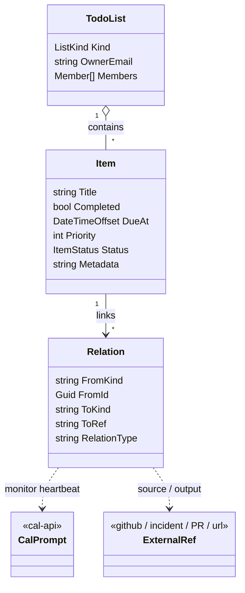

# Tracking backbone — the assistant's tracked-to-done backlog

**Status:** design. The API is deployed; proposed changes here are **additive and backward-compatible** (new events/fields/documents), not rewrites.
**Primacy:** REST + the `tasks` Marten store are primary. CalDAV/CardDAV VTODO is secondary — and the model already treats structured fields as canonical (VTODO is regenerated from the live snapshot; `SourceVtodo` only preserves unmodeled props), so no iCal-as-source-of-truth cleanup is needed here.

## Purpose

LupiraTasksApi is the assistant's (and the user's) **backlog** — the substrate for work that is **tracked to completion and has no firing moment**. It is the complement of LupiraCalApi:

- **cal-api** = things that **fire** (events, prompts that run at a time). Owns the clock.
- **tasks-api** = things **tracked to done** (open items with a lifecycle, no firing moment). Owns the backlog.

The decisive line is *fires vs tracked-to-done*, not *time-bound vs not* — tasks carry a `DueAt`, but tasks-api never fires on it. Anything that must happen at a time is a cal-api Prompt; tasks-api just tracks open work until it's closed.

Examples (assistant-driven): an unhealthy API → a **task** (fix it, tracked until closed); "notify me when the game releases" → a **task** (the durable goal) whose checking heartbeat is a cal-api Prompt; "research desserts Friday and report" → a cal-api **Prompt event**, *not* a task.

## What already supports it

| Need | Already in the code |
|---|---|
| Lists with roles | `TodoList` + `Member` (Owner/Editor/Viewer), `OwnerEmail` (`Domain/Lists/TodoList.cs`) |
| **Agent can own lists** | any email owns lists via `OwnerEmail`; no domain blocker — an agent principal owns its own lists and adds humans as members |
| Items tracked to done | `Item` — `Completed` + `CompletedAt/By`, `Reopened* `, soft `Deleted` (`Domain/Items/Item.cs`, `ItemState.cs`) |
| Due / assignee / priority / tags / subtasks | `DueAt`, `AssignedTo`, `Priority` (0..9), `Tags`, `ParentItemId` |
| Agent surface | MCP tools `list_my_lists / find_tasks / add_task / complete_task / reopen_task / update_task` (`Mcp/TaskTools.cs`), bearer JWT on-behalf-of (device-code + refresh) |
| Offline-safe writes | per-field LWW `(OccurredAt, CommandId)` + idempotency ledger, single `SaveChangesAsync` (`Application/Idempotency`, `Domain/Items/ItemLww.cs`) |
| Event sourcing | Marten inline snapshots, schema `tasks`, Sequence as sync-token (`Data/MartenRegistrations.cs`) |

So "the assistant gets its own lists and drives them" needs **no new model** — the MCP surface and ownership already cover it.

## Non-goal — no scheduler in tasks-api

tasks-api must **not** grow due-date firing, reminders, recurrence expansion, a daemon, or an outbox. That is exactly what cal-api's `scheduled_fire` engine is for. Keeping firing out of tasks-api is what makes the substrate split clean: any timed behaviour on a task is a **linked cal-api Prompt**, not a tasks-api feature. The existing `DueAt` stays a passive sort/display field.

## What needs to be implemented



### P1 — keystone: Relations / cross-links *(absent today)*
Mirror cal-api's `Relation` exactly, so the two services share one linking vocabulary:
```
Relation { FromKind="task"; FromId; ToKind; ToRef; RelationType; Metadata? }   // plain Marten doc, indexed by FromId
```
REST: `POST/GET/DELETE /lists/{listId}/items/{itemId}/relations`.
This is the keystone because it wires tasks into the assistant graph:
- **`ToKind="cal-item"`** → the cal-api Prompt that is this monitor's checking heartbeat.
- **`ToKind="url"`** → the GitHub issue/PR, the health-incident, the release page being watched.
- **`RelationType`** → `monitors`, `spawned-by`, `produced`, `blocked-by`, `relates-to`.

Without this, a task can't point at its heartbeat prompt or its source, and the standing-monitor pattern can't be expressed.

### P1 — agent-owned list designation
Add `ListKind.Agent` (alongside `Todo`, `Shopping`) **or** a `Managed` flag, so agent/system lists are distinguishable from the user's own lists in queries and UI. Functionally lists already work via `OwnerEmail` + membership; this is just the label. Scoping:
- **Per-user agent work** (research, follow-ups for user X) → a designated agent list in X's account, isolated per the platform's LLM/data-isolation rules.
- **System/ops work** ("API unhealthy", package upgrades) → an operator-owned list — the tasks counterpart of the **DevOps** calendar; not any end-user's.

### P2 — richer item status *(only `Completed: bool` today)*
Add an `ItemStatus` enum + reason so the assistant can represent stuck work, not just done/undone:
```
enum ItemStatus { Open, InProgress, Blocked, Waiting, Done, Cancelled }
event ItemStatusChanged(Guid ItemId, ItemStatus Status, string? Reason, DateTimeOffset OccurredAt, Guid CommandId)
```
One more LWW-guarded field (`StatusTs`/`StatusCmd`), `Done` staying equivalent to `Completed`. Lets the assistant answer "what's blocked / waiting on me?" — valuable for an autonomous backlog, but not required for the basic track-to-done loop.

### P2 — structured metadata on items *(absent; cal-api items have it)*
Add a JSONB `Metadata` field (whole-field LWW, mirroring cal-api `Item.Metadata`) for agent bookkeeping that doesn't deserve a typed column — source-alert id, check count, last-result summary. Server-side only; never in VTODO.

## The standing-monitor pattern (grounded)
"Keep checking until X" composes the two substrates rather than adding a scheduler here:
1. **Task** (tasks-api) — the durable goal, `Open` until met. The thing tracked.
2. **Recurring Prompt** (cal-api) — the checking heartbeat that fires on a schedule (cal-api owns firing).
3. **Link** — the task's `Relation(ToKind="cal-item", RelationType="monitors")` ↔ the prompt.
4. On a successful check the assistant **completes the task**, notifies, and **cancels the recurring prompt**.

## Consent & isolation
- **Agent self-tracking is internal bookkeeping** — creating its own task/list needs no user approval. The real-world action it leads to (the PR, writing the user's data, notifying) still follows consent-first.
- **Isolation** follows the platform rule: per-user agent lists are the user's and never cross users in an LLM call; system/ops lists are the operator's.

## Open decisions
1. Relations as a plain `Relation` doc (mirrors cal-api) vs per-item link collection with LWW — recommend the plain doc for symmetry.
2. Agent-list designation: a new `ListKind.Agent` vs a `Managed` boolean.
3. Whether richer `ItemStatus` (P2) is wanted now or deferred until the assistant needs blocked/waiting reasoning.
4. Should completing a monitor task auto-cancel its linked recurring prompt via the relation, or does the assistant do both explicitly.
