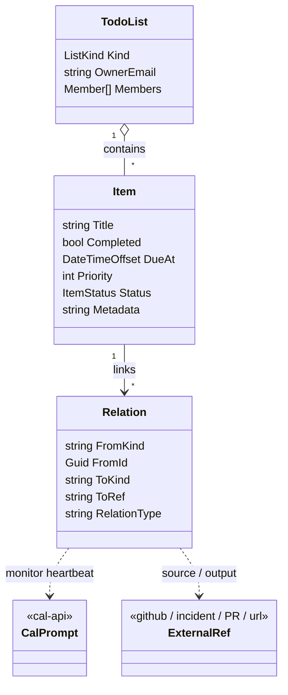

# Tracking backbone — the assistant's tracked-to-done backlog

**Status:** design record — the **intended final state** + rationale; it does not track build status. As-built structure: [architecture.md](architecture.md); implementation status + remaining work: `LupiraAssistantMobile/docs/roadmap.md`.
**Primacy:** REST + the `tasks` Marten store are primary. CalDAV/CardDAV VTODO is secondary — and the model already treats structured fields as canonical (VTODO is regenerated from the live snapshot; `SourceVtodo` only preserves unmodeled props), so no iCal-as-source-of-truth cleanup is needed here.

## Purpose

LupiraTasksApi is the assistant's (and the user's) **backlog** — the substrate for work that is **tracked to completion and has no firing moment**. It is the complement of LupiraCalApi:

- **cal-api** = things that **fire** (events, prompts that run at a time). Owns the clock.
- **tasks-api** = things **tracked to done** (open items with a lifecycle, no firing moment). Owns the backlog.

The decisive line is *fires vs tracked-to-done*, not *time-bound vs not* — tasks carry a `DueAt`, but tasks-api never fires on it. Anything that must happen at a time is a cal-api Prompt; tasks-api just tracks open work until it's closed.

Examples (assistant-driven): an unhealthy API → a **task** (fix it, tracked until closed); "notify me when the game releases" → a **task** (the durable goal) whose checking heartbeat is a cal-api Prompt; "research desserts Friday and report" → a cal-api **Prompt event**, *not* a task.

**Bills, deliveries and reply obligations are tasks** (tracked to done — paid / received / answered), never calendar events — assistant-api routes each to a dedicated, user-owned list it scaffolds on first use (**"Bills"**, **"Deliveries"**, **"Replies"**). The list is the classifier; the structured fields ride the item's `Metadata` blob (bill: `{ kind:"bill", amount, currency, payee, invoiceNumber }`; delivery: `{ kind:"delivery", carrier, trackingNumber, trackingUrl, orderReference }`; reply: `{ kind:"reply", topicRef, conversationRef, platform, counterpartyContactId }`). `DueAt` holds the payment due date / expected arrival — passive here; the timed nudge is a **linked cal-api Prompt** (`Relation(ToKind="cal-item", RelationType="monitors")`), exactly the standing-monitor shape below. A reply has no natural `DueAt` — its nudge is a recurring check-in until done, cancelled inline on completion.

## What already supports it

| Need | Already in the code |
|---|---|
| Lists with roles | `TodoList` + `Member` (Owner/Editor/Viewer), `OwnerEmail` (`Domain/Lists/TodoList.cs`) |
| **Agent can own lists** | any email owns lists via `OwnerEmail`; no domain blocker — an agent principal owns its own lists and adds humans as members |
| Items tracked to done | `Item` — `Status`-derived `Completed` + `CompletedAt/By`, reopen via `ItemReopened` (clears completion), soft `Deleted` (`Domain/Items/Item.cs`, `ItemState.cs`) |
| Due / assignee / priority / tags / subtasks | `DueAt`, `AssignedTo`, `Priority` (0..9, validated), `Tags`, `ParentItemId` — plus `Notes`, `Quantity`/`Unit` (shopping), `SortOrder`, `StatusReason` |
| Agent surface | 16 MCP tools — lists, tasks (incl. `set_task_status`/`set_task_metadata`), relations, sharing (`Mcp/TaskTools.cs`); OIDC bearer JWT, `/mcp` LAN/WireGuard-only |
| Offline-safe writes | per-field LWW `(OccurredAt, CommandId)` + idempotency ledger (insert-not-upsert, so a duplicate command rolls back whole), single `SaveChangesAsync` (`Data/Idempotency.cs`, `Domain/Items/ItemLww.cs`) |
| Event sourcing | Marten inline snapshots, schema `tasks` (`Data/MartenRegistrations.cs`); DAV sync-token = global event `Sequence`, REST `/sync` cursor = max item `Version` |

So "the assistant gets its own lists and drives them" needs **no new model** — the MCP surface and ownership already cover it.

## Non-goal — no scheduler in tasks-api

tasks-api must **not** grow due-date firing, reminders, recurrence expansion, a daemon, or an outbox. That is exactly what cal-api's `scheduled_fire` engine is for. Keeping firing out of tasks-api is what makes the substrate split clean: any timed behaviour on a task is a **linked cal-api Prompt**, not a tasks-api feature. The existing `DueAt` stays a passive sort/display field.

## The additions



### Keystone: Relations / cross-links — `Domain/Relation.cs`, `Application/RelationService.cs`
Mirror cal-api's `Relation` exactly, so the two services share one linking vocabulary:
```
Relation { FromKind="task"; FromId; ToKind; ToRef; RelationType; Metadata? }   // plain Marten doc, indexed by FromId
```
REST: `POST/GET/DELETE /lists/{listId}/items/{itemId}/relations`.
This is the keystone because it wires tasks into the assistant graph:
- **`ToKind="cal-item"`** → the cal-api Prompt that is this monitor's checking heartbeat.
- **`ToKind="url"`** → the GitHub issue/PR, the health-incident, the release page being watched.
- **`RelationType`** → `monitors`, `spawned-by`, `produced`, `blocked-by`, `relates-to`.
- `ToKind`/`RelationType` are deliberate **free-string conventions** (only non-empty enforced) — a shared vocabulary, not enums. Cross-API it is asymmetric by design: tasks→cal links use `ToKind="cal-item"`, cal→tasks use `ToKind="task"`.

Without this, a task can't point at its heartbeat prompt or its source, and the standing-monitor pattern can't be expressed.

### Agent-owned list designation — `ListKind.Agent`
`ListKind.Agent` (alongside `Todo`, `Shopping`) distinguishes agent/system lists from the user's own in queries and UI. Functionally lists already worked via `OwnerEmail` + membership; this is just the label. Scoping:
- **Per-user agent work** (research, follow-ups for user X) → a designated agent list in X's account, isolated per the platform's LLM/data-isolation rules.
- **System/ops work** ("API unhealthy", package upgrades) → an operator-owned list — the tasks counterpart of the **DevOps** calendar; not any end-user's.

### Richer item status — `Domain/Enums.cs`
An `ItemStatus` enum + reason so the assistant can represent stuck work, not just done/undone:
```
enum ItemStatus { Open, InProgress, Blocked, Waiting, Done, Cancelled }
event ItemStatusChanged(Guid ItemId, ItemStatus Status, string? Reason, DateTimeOffset OccurredAt, Guid CommandId)
```
One LWW-guarded lifecycle field shared by complete/reopen/status-change/VTODO; `Completed` is derived (`Status == Done`), and a reopen clears `CompletedAt/By`. Lets the assistant answer "what's blocked / waiting on me?".

### Structured metadata on items — `ItemMetadataSet`, whole-field LWW
A JSONB `Metadata` field (mirroring cal-api `Item.Metadata`) for agent bookkeeping that doesn't deserve a typed column — source-alert id, check count, last-result summary. Server-side only; never in VTODO or share links.

## Sharing & auth surfaces
- **Member sharing** — `POST /lists/{id}/shares` (create) · `GET` (list) · `DELETE` (revoke); a JWT'd caller joins via `POST /shares/redeem` (ReadWrite→Editor, Read→Viewer; never downgrades an existing member).
- **Account-less public shares** — `/shared/{token}`: a 256-bit opaque token (unique-indexed, expiry + revoke) with its own auth scheme; read **and write** (add/edit/complete/reopen/move/delete); DTOs strip all emails. `Metadata` never crosses either share surface.
- **Auth schemes:** OIDC bearer JWT (REST + `/mcp`; MCP additionally LAN/WireGuard-only, tunnelled requests rejected) · HTTP Basic → Authentik LDAP bind (DAV) · share token (public surface) · dev header (dev only).

## The standing-monitor pattern (grounded)
"Keep checking until X" composes the two substrates rather than adding a scheduler here:
1. **Task** (tasks-api) — the durable goal, `Open` until met. The thing tracked.
2. **Recurring Prompt** (cal-api) — the checking heartbeat that fires on a schedule (cal-api owns firing).
3. **Link** — the task's `Relation(ToKind="cal-item", RelationType="monitors")` ↔ the prompt.
4. On a successful check the assistant **completes the task**, notifies, and **cancels the recurring prompt**.

## Consent & isolation
- **Agent self-tracking is internal bookkeeping** — creating its own task/list needs no user approval. The real-world action it leads to (the PR, writing the user's data, notifying) still follows consent-first.
- **Isolation** follows the platform rule: per-user agent lists are the user's and never cross users in an LLM call; system/ops lists are the operator's.

## Decisions
1. ✅ Relations = a plain `Relation` doc (mirrors cal-api), deterministic tuple-derived id for idempotent link/unlink.
2. ✅ Agent-list designation = `ListKind.Agent`.
3. ✅ Richer `ItemStatus` shipped with the rest.
4. **Open:** completing a monitor task does NOT auto-cancel its linked recurring prompt — the assistant does both explicitly. Revisit if orphaned heartbeats become a problem.
